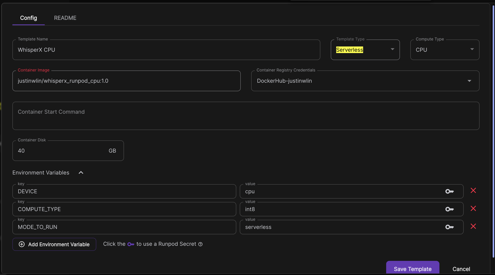

# Runpod WhisperX Runpod CPU Serverless

## Runpod Link:
https://runpod.io/console/deploy?template=x4kgjibge6&ref=wqryvm1m

To set to serverless, just change the environment variable to MODE_TO_RUN to serverless

The pod settings are great for yourself to test things out though, and has an example audio file in there.

## Quick Start:

Depot Command to Build (for myself pushing to my own repo. Modify to your own needs and push to your own docker account):
```
depot build -t justinwlin/whisperx_runpod_cpu:1.0 . --push --platform linux/amd64
```

## Summary
This is a repository using my [base repository](https://github.com/justinwlin/Runpod-GPU-And-Serverless-Base) to deploy whisperx using runpod's cpu serverless. This is to drastically reduce transcription cost.

## Deploying to Serverless Settings
Copy the settings provided here into a Runpod template, and then you can deploy it. For storage, you can use 20+gb whatever you feel is necessary. You get 10gb per every vcpu you allocate, so if you have 4vcpu, you can have up to 40gb of storage for your cpu serverless / pod. 

This just depends on how big of files you are planning to process / store / download / concurrently transcribe.



## Input:

`audio_base_64`: a base64 of your audio string
or
`audio_url`: a URL that the pod will try to download from. 

The reason why a URL is good is in case your audio file exceeds the 10mb limit for a Runpod request.
